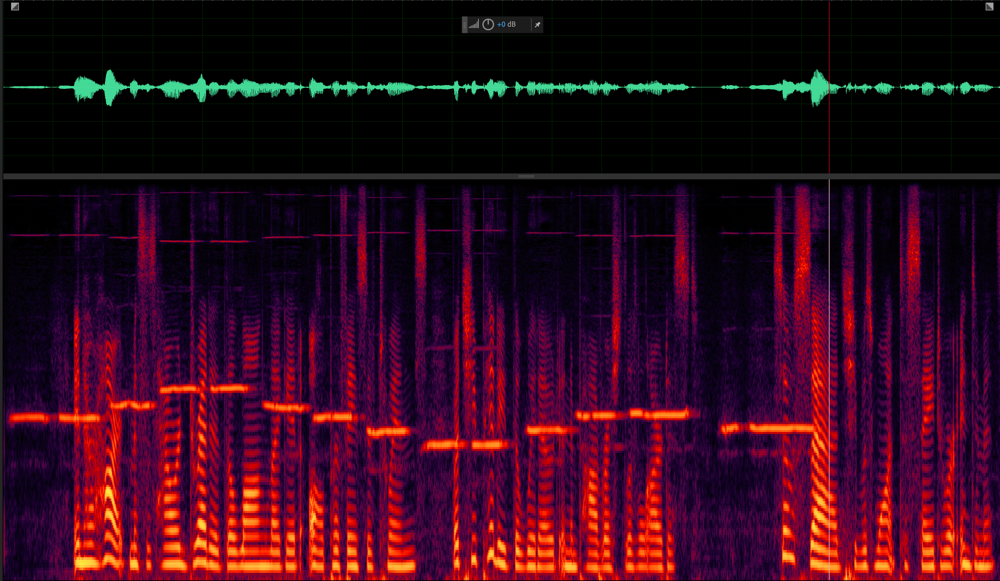
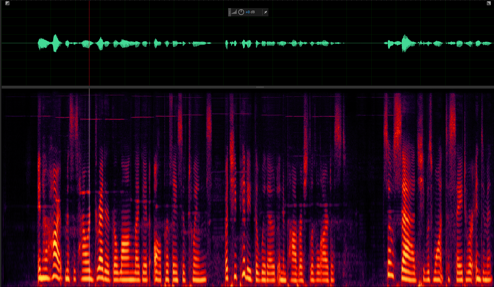
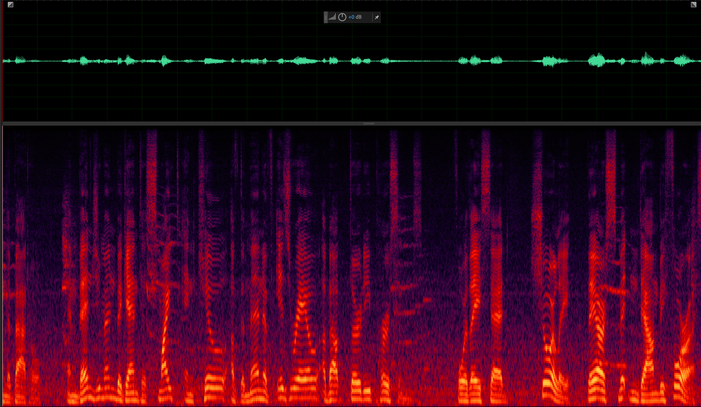
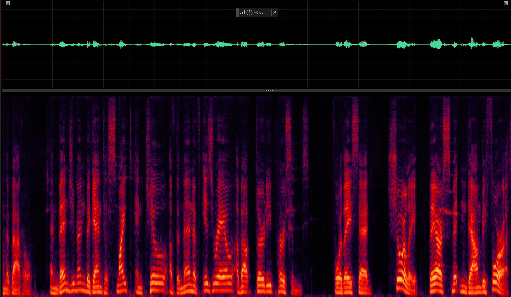
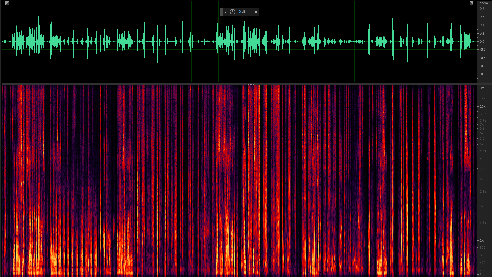
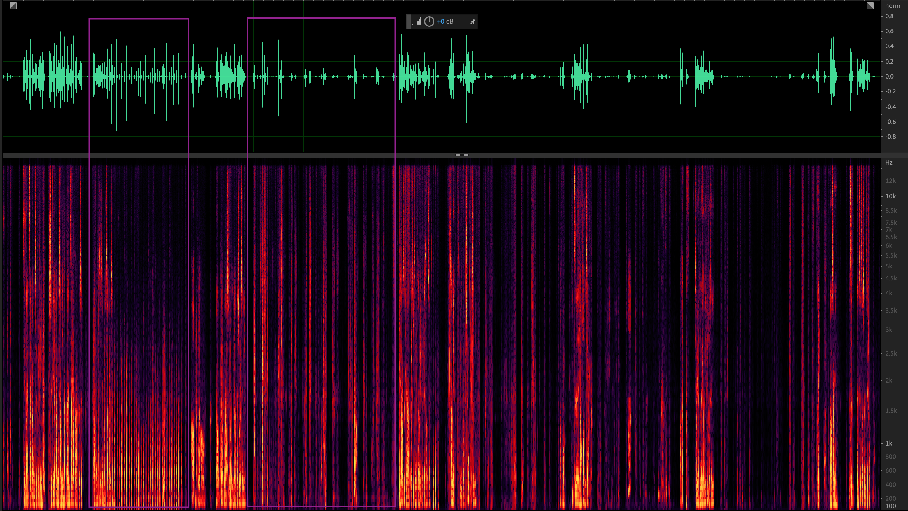
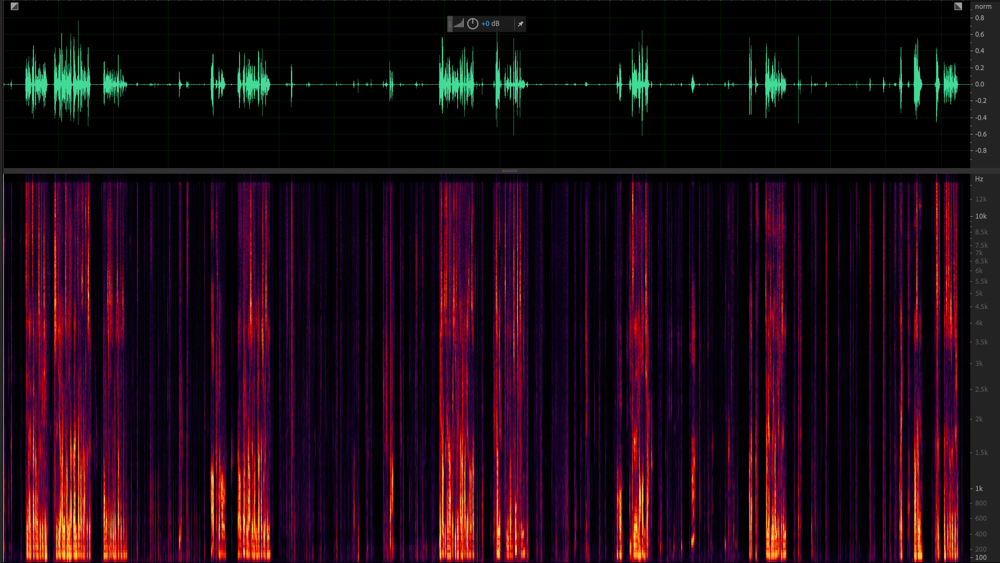

# DTLNPytorch
Hello! 这是一个有关用于语音降噪模型DTLN的Pytorch版仓库，其中包含了预训练模型，较完善的训练代码，支持断点训练，加载预训练模型训练，修改优化器，模型配置等功能。

## Requirements  
Ubuntu 18.04  
CUDA Version 11.6  
Python 3.8  
环境依赖见./requirements.txt
```python
conda create -n se python==3.8
pip install -r ./requirements.txt
```

## Prepare Data
这部分参见./dataloader.py中我为dataset写的几个继承于torch.utils.data.Dataset的类，建议实际训练的时候使用Dataset_DNS, 或者 Dataset_DNS_finetune(如果你需要微调模型的话)两个类。前者使用DNS-Challenge提供的数据格式， 后者支持自己加入数据混合DNS的数据一起训练。  


对于16k的模型训练，建议使用[DNS-Challenge2020](https://github.com/microsoft/DNS-Challenge/tree/interspeech2020/master)。需要git lfs技术进行大文件存储，git clone的时候注意一下分支，选择interspeech2020/master分支。参照官方教程将数据配置好。


对于32k的模型训练，建议使用[DNS-Challenge主分支](https://github.com/microsoft/DNS-Challenge)。使用其中的[download-dns-challenge-4.sh](https://github.com/microsoft/DNS-Challenge/blob/master/download-dns-challenge-4.sh)脚本进行下载，其中包含全频段的数据。下载后同样按照官方提供的.cfg配置文件以及.py脚本将数据处理成clean, noise, noisy三个文件夹。  


处理好的数据放置在dataset文件夹中，文件目录结构如下:
- dataset
    - clean
        - clean_fileid_0.wav
        - clean_fileid_1.wav
        - ...
    - noise
        - ...
    - noisy
        - **0.wav
        - **1.wav
        - ...  

其中clean语音和noisy语音一一对应，根据.wav前的那个数字。 noisy文件就是我们送入网络的输入，clean文件就是我们希望网络处理noisy后的目标文件。将clean和noisy的目录填入config/**.toml下的配置文件即可。

## Train Model
使用的是./train.py文件，整个训练代码架构较多参考了[FullSubnet-Plus](https://github.com/RookieJunChen/FullSubNet-plus)训练过程的代码实现。在./train_dns.toml配置好训练参数，执行以下:
```python
python train.py -C ./configs/train_dns.toml
```
或者
```python
nohup python train.py -C ./configs/train_dns.toml &
```

之后会在model下开创一个目录，目录名字即是你配置文件中的**save_model_dir+experiment_name**字段。会在该目录下生成**checkpoints**和**logs**两个子目录，分别存下训练过程中的模型以及loss。  


下面介绍下训练中断后如何续点训练。保证训练配置文件与原训练配置文件一致，执行以下：
```python
python train.py -C ./configs/train_dns.toml -R
```

## Eval Model
我在tools.trainer下留了个eval的接口:  
```python
def eval(self, model , eval_datalist):
    pass
```
供后来者需要在训练过程中评估模型指标使用。但笔者训练所使用的优化器并不是torch.optim.lr_scheduler.ReduceLROnPlateau, 因此自己并未完善。个人比较喜欢在一次完整的训练过程结束后评估模型指标，eval部分可以参考./eval.py及./evaler.py，这部分还未整理，并不是一个完全版。

个人训练32k的模型，帧长/移选用的是1024/256，在loss选取跟原作一样是SI-SDR的情况下，训练集参考[日志](https://github.com/Plutoisme/DTLNPytorch/blob/main/model/DTLN_0531_si-snr_lr%3D0.002/logs/train_log.txt)是在损失在-18+，个人实测测试集损失与训练集差距一般在1以内。(作者原作DTLN结果是-16+，但其是16k训练的模型，不好比较)

## Realtime Inference
实时推理需要了解Stateful RNN类模型的概念， 在训练过程中使用LSTM是能够自动将隐藏状态进行传递。但是在实际情况下我们接受到的信息是以帧为单位的， 需要人为将状态进行传递。根据DTLN作者原述**如果不考虑状态传递实际性能会下降**，个人理解也是如此，因为帧与帧之间推理的关系是独立的了。 具体实现单音频.wav文件推理可见./tools/realtimeInfer_32k.py, 实现一组音频.wav文件推理可见./tools/realtimeInfer_32k_dir.py。

在./tools/realtimeInfer_32k.py下配置好所选用模型的配置文件，模型.pth文件，输入的.wav文件及输出的.wav文件即可实现推理:
```python
cd ./tools
python realtimeInfer_32k.py
```


## Demonstrate
对./model/DTLN_0531_si-snr_lr==0.002下的模型，推理结果如下:
1. 第一组  
    输入音频:
    


    输出音频:
    

2. 第二组  
    输入音频:
    


    输出音频:
    


## Deploy on Arm32 CPU
得益于NCNN， 以及前人所做的工作。个人亲测可以部署在Android，RK1106， RK1126的CPU上运行。


DTLN模型适用于不同采样率的音频降噪任务，但16k的帧长/移较好的参数设置为512/128， 32k的帧长/移较好的参数设置为1024/256。其中帧长/移与模型的参数量相关，因此用于32k的模型参数量约为1.41M， 用于16k的模型参数量约为0.98M。而后者在RK1106的CPU上并无法实时运行。  


模型包含两个比较关键的操作影响部署的成功，一个是STFT，另一个是Stateful LSTM在目标推理框架下的支持性。DTLN包括两个stage，分别处理时频域的信号，负责时频两域的信号重建。在部署侧我们使用的是FFTW3库实现傅立叶变换，NCNN负责模型推理，将模型拆成**两部分**导出。  

1. 模型导出
模型导出TorchScript形式见./modules/dtln_ns_export.py，在其主函数中配置好导出路径以及所加载的模型数据，执行以下即可导出:
    ```python
    python ./modules/dtlnModel_ns_export.py
    ```
2. 编译ncnn(开发机和目标机各一份)  
准备交叉编译工具，具体见[ncnn](https://github.com/Tencent/ncnn)，对ncnn进行开发机的编译及目标机上面的编译。

3. 准备pnnx模型转换工具，实现模型转换  
ncnn自带了一份[pnnx](https://github.com/Tencent/ncnn/tree/master/tools/pnnx)，实现torch模型到ncnn模型格式的转化。  
    按照教程安装好pnnx后，执行以下:
    ```python
    pnnx dtln_ns_p1.pt inputshape=[1,1,513],[1,1,128],[1,1,128],[1,1,128],[1,1,128]
    pnnx dtln_ns_p2.pt inputshape=[1,1024,1],[1,1,128],[1,1,128],[1,1,128],[1,1,128]
    ```
    即可在当前目录生成pnnx以及ncnn的模型格式文件，以及相关的.py文件，.py文件中的test_inference可以很方便地帮你测试导出的模型推理精度是否存在问题。
    此时生成的文件中的dtln_ns_p1.ncnn.bin, dtln_ns_p1.ncnn.param, dtln_ns_p2.ncnn.bin, dtln_ns_p2.ncnn.param是我们使用C++推理需要的文件。
    ```
    rsync -avP dtln_ns_p*.ncnn.param ./deploy_32k/model
    rsync -avP dtln_ns_p*.ncnn.bin ./deploy_32k/model
    ```

4. 编译FFTW3  
准备好交叉编译工具， 编译FFTW3

5. 编译移动端推理demo  
    ```python
    cd deploy_32k
    ```
    在./CMakeLists.txt配置好依赖库(ncnn, FFTW3)的头文件路径以及链接库路径，设置好交叉编译工具。
    ```
    mkdir build_arm_linux
    cd build_arm_linux
    cmake .. #交叉编译设置也可以在这里设，我的开发机有的时候会抽风
    make
    ```

6. 查看demo效果  
    将生成的可执行文件dtln, model文件夹， 准备的测试音频(.pcm格式)推送到目标机上。
    在目标机上执行:
    ```python
    ./dtln ./model ./testdata_in.pcm ./testdata_out.pcm
    ```
    该可执行程序接受一个存放model的目录，接受一个测试输入音频testdata_in.pcm，输出一个结果音频testdata_out.pcm

## Deploy on RK NPU
要将模型部署在RKNPU上，首先需要使用RK提供的工具转化为rknn格式，RK系列下的不同芯片，其对模型算子和结构的支持不一样，以下以1106为例。

1106使用的是[rknn-toolkit2](https://github.com/rockchip-linux/rknn-toolkit2)进行模型转换，具体支持算子和结构见官方文档，这里简单总结下，原始DTLN模型在进入LSTM前需要进行一次LayerNorm，该结构不被1106的rknn支持，自己实现的话所需的div，mean等算子也不被支持。因此要导出需要训练一个不含LayerNorm的模型导出，同样分为2个stage导出，中间穿插FFT的处理。


适用于rknn的模型需要不添加LayerNorm，根据作者原作不加该层会有约0.5的SI-SDR损失，但我[复现的结果](https://github.com/Plutoisme/DTLNPytorch/blob/main/model/DTLN_0603_npu_nonorm/logs/train_log.txt)较差，在相同训练集上的拟合能力相差约1.5的SI-SDR，测试集方面还未来得及测试。

假设你已经有一个表现不错的删去Layernorm的网络模型，下面进行以下操作：
1. 模型导出TorchScript  
    导出适用于rknn的模型代码参考./modules/dtlnModel_ns_export_rk.py, 同样的需要设置导出模型的路径，所需要导出的.pth路径。会生成两个模型文件dtln_p1_rk.pt以及dtln_p2_rk.pt。
    ```python
    cd modules
    python ./dtlnModel_ns_export_rk.py
    ```

2. 使用rknn-toolkit2，将TorchScript转化成rknn  
    参照rknn-toolkit2提供的文档，在开发机上面配置好转换环境。
    参考rknn提供的官方[Pytorch转化demo](https://github.com/rockchip-linux/rknn-toolkit2/blob/master/examples/pytorch/resnet18/test.py)，编写转化rknn代码。这里可以参考我写的./modules/dtln_ns_test.py 以及 ./modules/dtln_ns_test_p2.py。分别是第一个阶段以及第二个阶段的模型转换。

3. 量化准备  
    torchscript转成rknn需要经过模型量化，其中量化是根据所提供的输入的mean_values, std_values确定的，另外还可以提供一个datasets.txt来进行量化校准。 [./tools/for_quantization.py](https://github.com/Plutoisme/DTLNPytorch/blob/main/tools/for_quantization.py)是我写的计算mean_values, std_values的工具，给定一组用于计算mean_values, std_values的量化音频(文件夹格式)，可以输出两个模型共10个输入的mean_values以及std_values，可以计算流式推理中帧之间传递的state的mean_values和std_values(这部分是这一步比较繁杂的点)。

4. 编写部署代码(作者未完成)  
    [rknpu2](https://github.com/rockchip-linux/rknpu2)提供了部署代码编写的C版本demo，个人想将其集成到./deploy_32k/src/DTLN_NS_ncnn.cpp中去实现npu推理，尚未完成。


## Finetune
DNS-Challenge的数据集质量参差不齐，其中有的clean语音还夹杂着少许噪声，因此很多大牛传授的经验是需要先用一个baseline模型去对clean语音先降一次噪再做后续的处理。 这边并没有做相关尝试， 但是提供了一个自制数据集finetune的接口。 自制的数据包括clean， noise语音，noisy语音在自定义的./dataloader.py中的Dataset_DNS_finetune类中。

个人finetune相关理论是从李宏毅老师中的机器学习课程中的迁移学习部分当中学到的，具体到本次任务中就是加入finetune的数据，分别是finetune_clean_data_dirname 以及 finetune_noise_data_dirname， 为了防止模型对新加入的数据过拟合，还需要一部分原来的数据。 这部分数据的比例通过./configs/train_finetune.toml中的how_many_finetune_h, 以及how_many_initial_h进行配置。这两个参数决定了选择多少个小时新数据，以及多少个小时的旧数据。

finetune需要配置一个预训练模型，这部分在./config/train_finetune.toml中preload_model_path配置。
配置好后执行:
```python
python train_finetune.py 
```
即开启模型finetune任务。

作者原本只采用了[DNS-Challenge-master](https://github.com/microsoft/DNS-Challenge)中的提供的download-dns-challenge-4.sh中的read_speech中的十五个压缩包，所有噪声文件生成的200h的数据进行训练，结果发现对非稳态噪声的降噪能力还有所欠缺，因此对非稳态降噪方面进行深一步探究，也为了进一步适配目标设备芯片自带算法，仅录制了1h的噪声，后跟不同的speech组合生成20h的noisy语音进行对特定噪声的finetune。finetune策略采用20h的新数据， 以及1h的DNS的旧数据，具体可见[finetune日志](https://github.com/Plutoisme/DTLNPytorch/tree/main/model/DTLN_0602_finetune_lr0.00005_onlynewdata)。方案见效果对比如下:


1. 处理的语音对象，含不同的非稳态噪声  
    

2. [finetune前](https://github.com/Plutoisme/DTLNPytorch/tree/main/model/DTLN_0531_si-snr_lr%3D0.002)，部分DNS提供的数据训练出的模型，对部分非稳态噪声并没有效果:  
    

3. [finetune后，增加了自录1h的噪声数据，生成20h的noisy带噪语音训练](https://github.com/Plutoisme/DTLNPytorch/tree/main/model/DTLN_0602_finetune_lr0.00005_onlynewdata), 对该非稳态噪声有了抑制效果：
    

因此后续可以在配置文件中添加扩展，针对不同场景，不同设备加入数据增广，使得模型具有更好的适配性。

## Some Tools
有一些方便的小工具可以帮助你扩展实现一些功能，我将其存放在tools当中。  
1. initial_model.py可以帮助你根据配置文件初始化一个示例类
2. calculate_runtime.py可以帮助你评估模型算力以及参数量
3. calculateTools.py中包含一些对音频处理的工具，在你需要自定义dataset时可能会提供到帮助，如控制音量，控制信噪比，采样固定长度等。


## Citing
借鉴了[DTLN的Tensorflow->Pytorch转换及NCNN部署](https://github.com/lhwcv/DTLN_pytorch)，实现模型的NCNN部署，所使用的模型结构为了能和其代码对接，使用的是其模型结构(我自己写的转了移动端推理不对，后面直接用这位大佬的了)。
另外，参考DTLN原作论文:
```python
@inproceedings{Westhausen2020,
  author={Nils L. Westhausen and Bernd T. Meyer},
  title={{Dual-Signal Transformation LSTM Network for Real-Time Noise Suppression}},
  year=2020,
  booktitle={Proc. Interspeech 2020},
  pages={2477--2481},
  doi={10.21437/Interspeech.2020-2631},
  url={http://dx.doi.org/10.21437/Interspeech.2020-2631}
}
```

DNS-Challenge:
```
@inproceedings{dubey2023icassp,
  title={Deep Speech Enhancement Challenge at ICASSP 2023},
  author={
 Dubey, Harishchandra and Aazami, Ashkan and Gopal, Vishak and Naderi, Babak and Braun, Sebastian and  Cutler, Ross and Gamper, Hannes and Golestaneh, Mehrsa and Aichner, Robert},
  booktitle={ICASSP},
  year={2023}
}
```